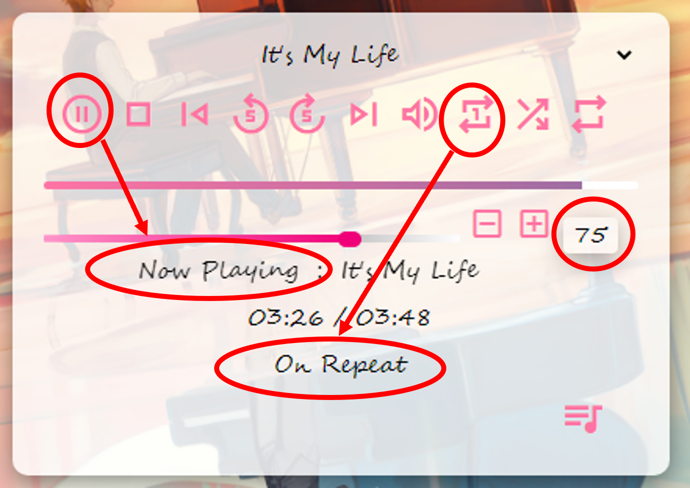
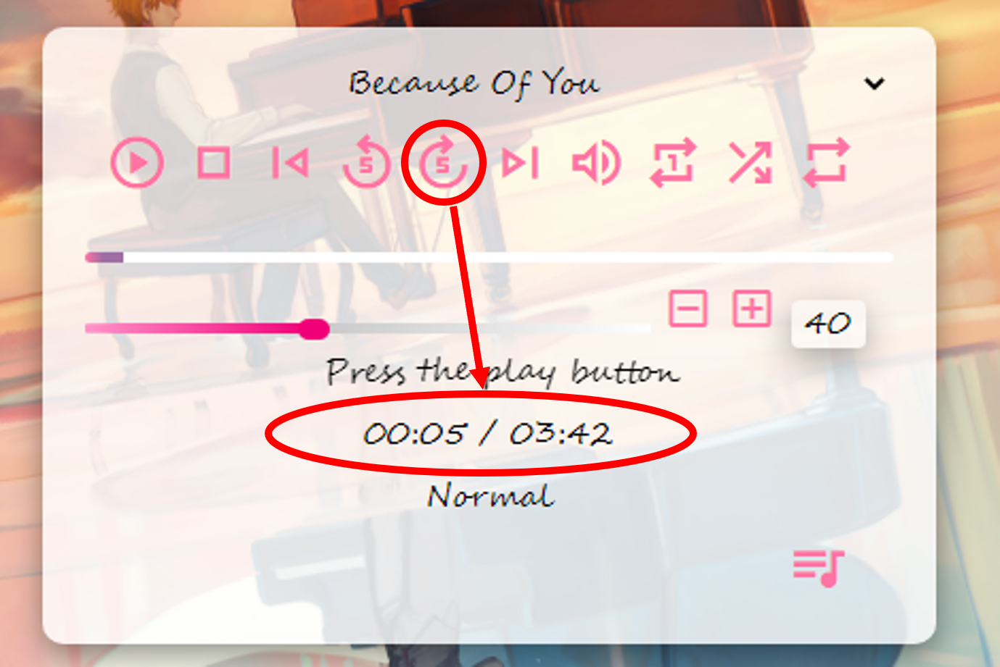
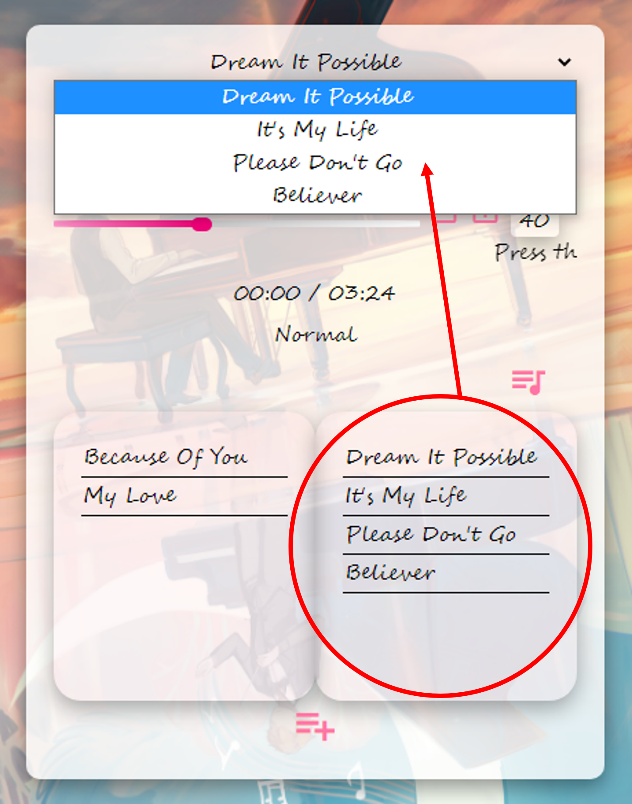

# MusicPlayer  
HTML+CSS+JavaScript綜合應用，含有以下功能：
  
1.有按鈕可執行播放、停止與暫停的功能。  
2.有按鈕執行上一首的下一首的功能。  
3.有直接選擇曲目的功能。  
4.有按鈕可執行快轉及倒轉的功能。  
5.有按鈕可執行單曲循環、全部循環及隨機選曲播放的功能。  
6.有音量控制的功能。  
7.有資訊看版可顯示目前播放狀態及目前播放曲目的功能。  
8.有播放進度條，並可由進度條調整曲目快轉或倒轉的功能。  
9.有我的歌本功能，可供編輯想聽的歌曲。  
  
  
  
  
